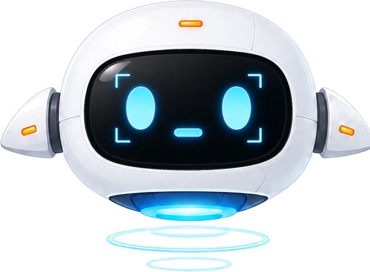
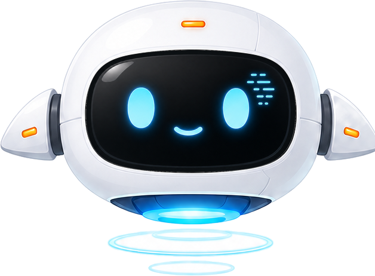

<div align="center">

# 🪟 Local Window Copilot

**Windows 本地陪伴式桌面伙伴**

*默认陪伴，不默认汇报 · 默认沉默，不默认分析 · 用户邀请时，才认真看、认真想、认真回应*

<br>


<br>


<br>

[产品规格](project_plan/ambient_companion_product_spec_zh.md) · [开发指南](docs/development_guide_zh.md) · [桌宠素材](assets/mascot/README.md)

</div>

---

## ✨ 这是什么

Local Window Copilot 是一个**本地、轻量、低打扰**的陪伴式桌面伙伴。它安静地在桌面上存在，理解你的工作节奏，能被随时唤起。

它不是又一个屏幕分析器，也不是自动控制型 Agent。它的价值在于：

- 🤫 **平时安静陪伴** —— 看到状态变化但不急着打断
- 💬 **随时进入对话** —— 你想互动时立刻回应
- 🔍 **认真拆解分析** —— 你想分析时才调用视觉、历史和记忆
- 🏠 **完全本地运行** —— 不要求 Redis / PostgreSQL / Docker，SQLite 足矣
- 🚫 **不替你操作电脑** —— 可以观察、陪伴、解释、建议、记录，但不自动点击/输入/提交

> 截图、VLM、摘要、记忆是后台感知器官，不是产品本体。

---

## 🎭 桌宠状态

桌宠有 5 种核心状态，对应不同的工作情境。它会根据你的工作节奏自然切换表情和姿态。

<table>
<tr>
<td align="center" width="20%">
<br>
<b>😴 Idle</b><br>
<sub>默认陪伴，轻微呼吸</sub>
</td>
<td align="center" width="20%">
<br>
<b>👀 Observing</b><br>
<sub>注意到状态变化</sub>
</td>
<td align="center" width="20%">
<br>
<b>🧠 Analyzing</b><br>
<sub>认真分析当前屏幕</sub>
</td>
<td align="center" width="20%">
<br>
<b>🔒 Privacy</b><br>
<sub>隐私模式，停止观察</sub>
</td>
<td align="center" width="20%">
<br>
<b>⚠️ Error</b><br>
<sub>遇到问题，需要关注</sub>
</td>
</tr>
</table>

---

## 🏗️ 三层产品结构

```
┌─────────────────────────────────────────────────────────────┐
│                    桌面悬浮窗 (桌宠 UI)                       │
│              呼吸 · 眨眼 · 悬浮 · 状态指示灯                   │
└──────────────────────────┬──────────────────────────────────┘
                           │
          ┌────────────────┼────────────────┐
          ▼                ▼                ▼
   ┌──────────────┐ ┌──────────────┐ ┌──────────────┐
   │  Presence    │ │  Companion   │ │   Work Lens  │
   │  存在层      │ │  陪伴层       │ │   工作透镜    │
   ├──────────────┤ ├──────────────┤ ├──────────────┤
   │ 呼吸/表情    │ │ 情绪回应     │ │ 视觉分析     │
   │ 姿态动画     │ │ 对话陪伴     │ │ 上下文拆解   │
   │ 不展示文字   │ │ 记忆+人格    │ │ 用户邀请才触发│
   └──────────────┘ └──────────────┘ └──────────────┘
          │                │                │
          └────────────────┼────────────────┘
                           ▼
              ┌────────────────────────┐
              │   FastAPI Backend      │
              │   ┌──────────────────┐ │
              │   │ SQLite Runtime   │ │  ← 本地存储，无需外部服务
              │   │ Store            │ │
              │   └──────────────────┘ │
              │   ┌──────────────────┐ │
              │   │ llama.cpp Server │ │  ← 本地 LLM 推理
              │   └──────────────────┘ │
              │   ┌──────────────────┐ │
              │   │ MiniCPM-V VLM    │ │  ← 视觉语言模型
              │   └──────────────────┘ │
              └────────────────────────┘
```

| 层级 | 职责 | 何时工作 |
|------|------|----------|
| **Presence Layer** 存在层 | 让桌宠像"在场"，而不是按钮 | 始终运行，低频动画 |
| **Companion Layer** 陪伴层 | 情绪回应、对话陪伴、记忆与人格 | 用户说话时激活 |
| **Work Lens** 工作透镜 | 调用视觉和上下文做认真分析 | 仅用户邀请时触发 |

---

## 🧩 Agent 工具层

模型可见的工具只有三个，保持克制：

```
screen.look       看当前/最近屏幕，内部调用截图索引、局部裁剪和 VLM
memory.search     查 profile、短期记忆、最近对话和屏幕索引
memory.remember   只在用户明确要求"记住"时写入本地记忆
```

后端 provider 提供：`current_screen` / `screen_history` / `vision.inspect` / `profile.md` / `runtime memory` / `conversation history`

---

## 🚀 快速开始

### 环境要求

- Windows 10 / 11
- Python 3.11+
- [uv](https://docs.astral.sh/uv/) (Python 包管理)
- [llama.cpp](https://github.com/ggml-org/llama.cpp) server (本地 LLM 推理)
- 可选：MiniCPM-V 模型权重 (视觉分析功能)

### 一键启动

```powershell
cd D:\AI_Workspace\window
.\scripts\start_dev.cmd
```

### 启动前检查

```powershell
python .\scripts\check_environment.py --for-start
```

### 手动启动后端

```powershell
cd D:\AI_Workspace\window\backend
uv run uvicorn app.main:app --host 127.0.0.1 --port 18080 --reload --no-access-log
```

### 手动启动悬浮窗

```powershell
cd D:\AI_Workspace\window
.\apps\desktop-floating-window\start_desktop_window.cmd
```

### WebUI 控制台

启动后访问：**http://127.0.0.1:18080/webui/**

---

## 🎬 演示场景

> 📌 以下为产品设计的典型交互场景，演示 GIF 将在正式发布后补充。

### 场景一：陪伴模式

```
用户：我觉得这个方向不对。
桌宠：我也感觉你不是在挑某个实现细节，而是在怀疑"摘要作为中心"这件事。
      我们可以先不急着改代码，把产品灵魂重新定一下。
```

### 场景二：工作透镜

```
用户：（点击桌宠"观察"按钮）
桌宠：[切换到 analyzing 状态] 
      我看到你现在在 IDE 里，打开了三个文件，光标停在 window_analysis.py。
      这个函数最近的改动引入了一个未关闭的 session，要我帮你看看吗？
```

### 场景三：低打扰主动提示

```
[用户在同一任务上停留 45 分钟，反复切换三个窗口]
桌宠：[轻微 observing 状态，不弹窗]
      → 仅在悬浮窗角标显示一个小提示点，用户注意到时才展开
```

---

## 🛠️ 技术栈

| 组件 | 技术 | 说明 |
|------|------|------|
| 后端框架 | FastAPI | 异步 API，自带 OpenAPI 文档 |
| 本地存储 | SQLite | RuntimeStore，零配置 |
| LLM 推理 | llama.cpp | 本地部署，保护隐私 |
| 视觉模型 | MiniCPM-V | 视觉语言模型，屏幕理解 |
| 桌面 UI | Python + Win32 | 悬浮窗，透明置顶 |
| 包管理 | uv | 快速依赖管理 |
| 测试 | pytest | 内置测试套件 |

---

## 📡 接口一览

```text
# 助手状态与对话
GET  /health
GET  /api/assistant/state
POST /api/assistant/state
GET  /api/assistant/latest
POST /api/assistant/questions
GET  /api/assistant/conversation
GET  /api/assistant/conversations
POST /api/assistant/conversations/clear
GET  /api/assistant/context-preview
POST /api/assistant/resume

# WebUI 配置
GET  /api/webui/config
PUT  /api/webui/config
POST /api/webui/reload
GET  /api/webui/window-summaries
POST /api/webui/window-summaries/clear

# 窗口捕获与监听
POST /api/window/capture
POST /api/window/watch/start
POST /api/window/watch/stop
GET  /api/window/watch/status
```

完整 API 文档：启动后访问 `http://127.0.0.1:18080/docs`

---

## 📂 代码入口

```text
backend/app/main.py                              # FastAPI 入口
backend/app/services/runtime_store.py             # SQLite RuntimeStore
backend/app/services/window_capture.py            # 窗口截图
backend/app/services/window_watcher.py            # 窗口监听
backend/app/services/window_analysis.py           # 窗口分析
backend/app/services/observation_builder.py       # 观察构建器
backend/app/services/assistant_chat.py            # 对话 agent 会话入口
backend/app/services/agent_orchestrator.py        # Hermes-like 工具规划与编排
backend/app/services/agent_tools.py               # 三个模型可见工具 + provider
backend/app/services/situation_builder.py         # 情境状态构建器 (spec §8.2)
backend/app/services/interaction_policy.py        # 主动提示策略 (spec §8.3)
backend/app/services/screenshot_crop.py           # 局部截图裁剪 (spec §9 Phase 4)
backend/app/services/vision_model_client.py       # VLM 客户端 + 分层 messages
backend/app/services/profile_store.py             # profile md 管理
backend/app/services/memory.py                    # 记忆系统
apps/desktop-floating-window/desktop_floating_window.py  # 桌宠悬浮窗
experiments/prompts/companion_chat_v1.txt         # 陪伴模式 prompt
experiments/prompts/visual_question_answer_v1.txt       # 视觉问答 prompt
```

---

## 🧪 测试

```powershell
cd D:\AI_Workspace\window\backend
uv run pytest --basetemp D:\AI_Workspace\window\.tmp\pytest-basetemp
```

---

## 💾 数据存储

`RuntimeStore` 是本地 SQLite 文件，默认路径：

```
backend/data/runtime/runtime.sqlite3
```

保存内容：助手状态、最近窗口分析、当前对话、历史对话、短期会话记忆、用户最近目标与困惑。**普通用户不需要安装任何额外服务。**

---

## 📐 产品原则

详见 [产品规格文档](project_plan/ambient_companion_product_spec_zh.md)：

1. **默认不汇报屏幕** —— 屏幕分析结果默认进后台，只在用户主动邀请时展示
2. **陪伴优先于分析** —— 先接住用户的情绪和判断，再根据需要进入分析
3. **低打扰是能力** —— 高质量陪伴需要会沉默，主动发言必须满足明确条件
4. **不伪装能力** —— 主链路不清楚就明确说不清楚
5. **不替用户操作电脑** —— 可以观察、陪伴、解释、建议、记录，但不自动执行

---

## 🗺️ 路线图

- [x] 桌宠悬浮窗 + 5 种状态动画
- [x] FastAPI 后端 + SQLite RuntimeStore
- [x] 窗口捕获与分析
- [x] MiniCPM-V 视觉语言模型接入
- [x] 陪伴对话 + 工具编排
- [ ] 演示 GIF / 视频录制
- [ ] Rive 动画迁移（替代 PNG 精灵图）
- [ ] 长期记忆向量检索
- [ ] 多显示器支持

---

## 📄 License

MIT License — 详见 [LICENSE](LICENSE)

---

<div align="center">

**Made with 🤍 by [宋林蔚](https://github.com/fjnuslw)**

*如果这个项目对你有启发，欢迎 ⭐ Star*

</div>
